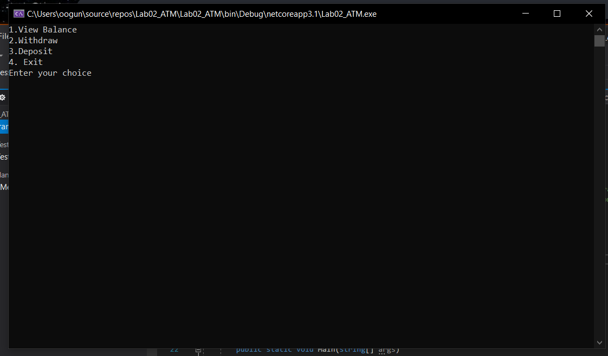
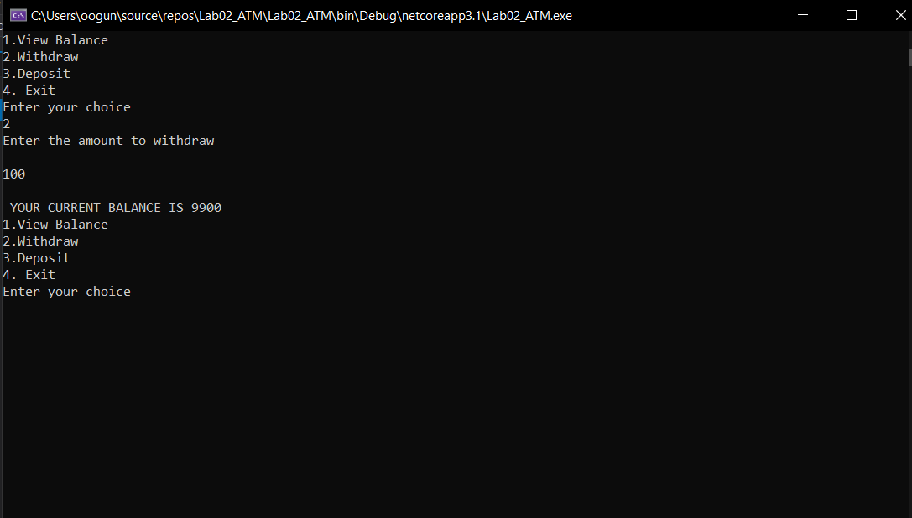
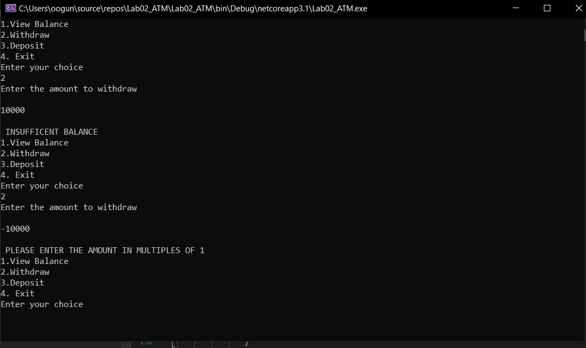
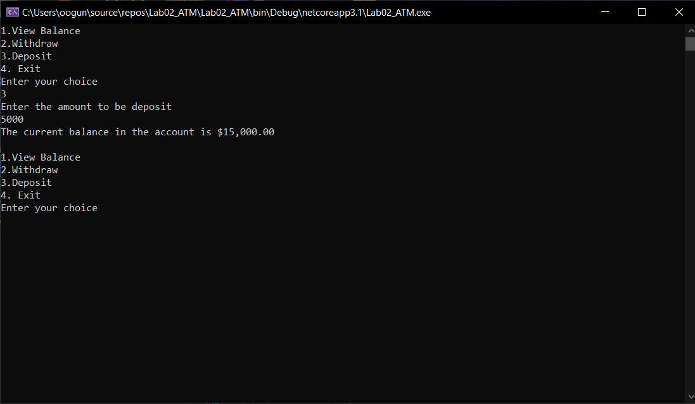
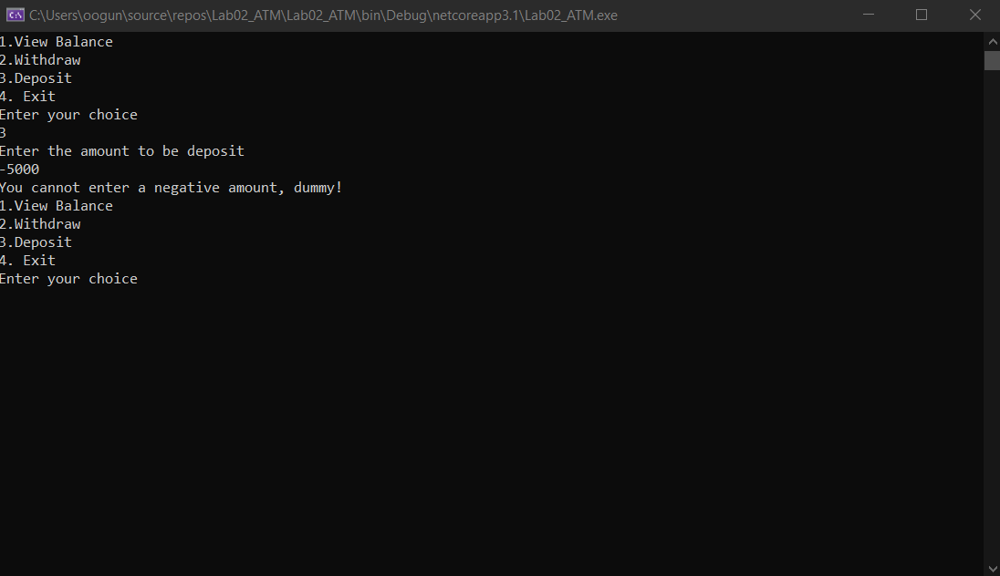

#ATM CONSOLE APPLICATION - WITH UNIT TESTING

Author: Lami Beach
____________________________________________________________________________________________________________________________________________________________________________________________________________________________________________________________________________________________________________________________________________________________________________________________________________________________________________________________________________________________________________________________________________________________________________________________________________________________________________________________________________________________________________________

Description :

This application is meant to be an phaux (I'm patenting this word, it was supposed to be faux, but I was tired) ATM. It is also implemented with Unit Testing.
____________________________________________________________________________________________________________________________________________________________________________________________________________________________________________________________________________________________________________________________________________________________________________________________________________________________________________________________________________________________________________________________________________________________________________________________________________________________________________________________________________________________________________________

Program Specifications Using Test Driven Development, build out a console application that mocks the functionality of an ATM. 

Your solution should include the following methods:

Main method Call the user interface method to activate the application

Testable external methods: ViewBalance()

Functionality: Returns the value of the current balance Return: decimal

Test to ensure that the balance properly shows the correct amount after each transaction

Withdraw() Functionality: Subtracts money from the balance Return: decimal Do not allow the user to withdraw more money than what’s available. Do not allow the user to withdraw a value less than zero.

Deposit() Return: decimal Functionality: Adds money to the balance Do not allow the user to deposit a negative amount Variable to hold the current Balance of the account. Make this a static public decimal Balance variable, declared above the Main() method. This will allow you to access the Balance variable anywhere in this Program.cs file. User interface that prompts the user for standard ATM operations that links to each of the above external methods Return : void Keep asking the user to choose a transaction until they choose to ‘exit’ the application. (while loop??) This method is where you will want to hold all of your Console.ReadLines. This method does NOT need to be tested.

A few things to keep in mind: Make sure the user can’t go below a zero balance. You cannot unit test console WriteLine or Readlines. Make sure your methods are just returning values and not reading input from the console. Remember to use the proper data types while working within the program. Money is usually represented by decimals. All methods within the program class should start their method signature with static public followed by the return type and method name. Example public static void UserInterface()

When running your application, it should activate the user interface without any direct code manipulation.

Stay within scope of the what we have learned so far in the class.

If we have not officially learned the concept you are trying to implement, then don’t use it. Ask the instructor or TA if you have any questions about the scope. Unit Tests UNIT TEST Write unit tests in a new project using the XUnit library. Test the functionality for the above application. Here are the testing requirements:

Test every method/action (that does not require user input); there should be a passing valid input, and a passing invalid input. Have at least 2 tests for every non-void method. A failing test, is not a valid test - even if the failure is expected.

____________________________________________________________________________________________________________________________________________________________________________________________________________________________________________________________________________________________________________________________________________________________________________________________________________________________________________________________________________________________________________________________________________________________________________________________________________________________________________________________________________________________________________________

# How it works:

1. Initiate my console app

For the first part I want to establish my intiate sequence and start the atm program.
I do that by first putting my ViewBalance above all as to be able to access it from anywhere.
OprahsBankAccount is my initiation sequence.
This starts my application.
OprahsBankAccount holds the main methods needed for the ATM:
While Loop: Maintains the UI and doesn't close unless the user wants it to.
if/else statements: shows balance, calculates money withdrew, calculates money deposited, and allows you to quit.

2. Withdraw methodd

Withdraw method takes the given amount and uses if/else statements to not only calculate the users withdraw amount, 
but also, allows the user to take out money less than 10 dollars. If the user tries to withdraw more than available
the user will be promptly declined and asked to take out an amount within their scopre of money.
I wanted the user to be able to take out money up until 1 dollar, and ask the user to input money in 1 dollar amounts. Because
I don't like the fact ATM's only allow you to take out 10 dollars at a time.
The user may not withdraw a negative amount.

3. Deposit method

The deposit method allows you to deposit money in order to raise your bank account.
I used a try catch to attempt to deposit the amount, if not, catch the exception.
The deposit method doesn't allow you to deposit a negative number.
If you attempt to deposit a negative number you are prompted to enter in multiples of 1's.

____________________________________________________________________________________________________________________________________________________________________________________________________________________________________________________________________________________________________________________________________________________________________________________________________________________________________________________________________________________________________________________________________________________________________________________________________________________________________________________________________________________________________________________

Resources: 

Include Help
____________
[IncludeHelp.com](https://www.includehelp.com/dot-net/make-a-simple-atm-machine.aspx)

Include Help honestly helped me understand the logic of what I was doing. I could have used the "switch statement" provided but
decided against it because I preferred if/else better. And because who wants to just copy someone's work? Where's the fun? The struggle?
They also gave me a better understanding of using "switch statements" because they make your life a helluva lot easier.

____________________________________________________________________________________________________________________________________________________________________________________________________________________________________________________________________________________________________________________________________________________________________________________________________________________________________________________________________________________________________________________________________________________________________________________________________________________________________________________________________________________________________________________
